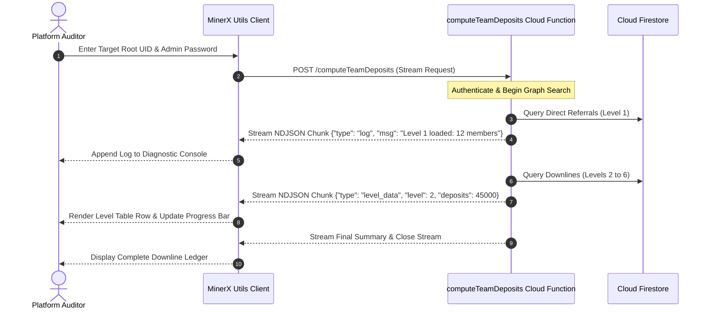

# MinerX Utils (Streaming Network Diagnostic Tool)

[](https://developer.mozilla.org)
[](https://developer.mozilla.org/en-US/docs/Web/JavaScript)
[](https://ndjson.org)
[](https://firebase.google.com/docs/functions)
[](LICENSE)

> Interactive web-based administrative diagnostic console for MinerX Global, streaming real-time downline tree calculations and financial deposits via NDJSON over HTTP fetch readers.

---

## 📖 Overview

**MinerX Utils** is a purpose-built administrative inspection tool created for network auditors and support engineers operating the MinerX Global platform. Rather than waiting for heavy batch operations to complete, this web application connects directly to the `computeTeamDeposits` Cloud Function, ingests streamed **NDJSON (Newline Delimited JSON)** chunks over an HTTP chunked reader, and renders real-time computational progress, level-by-level member lists, and cumulative deposit volumes.

### Key Capabilities
- **Real-Time NDJSON Stream Ingestion**: Utilizes the modern `ReadableStreamDefaultReader` and `TextDecoder` APIs to parse live progress chunks without blocking the UI thread.
- **Hierarchical Network Auditing**: Reconstructs multi-level referral networks on the fly, displaying member counts, deposit totals, and tier breakdowns.
- **Interactive Log Console**: Live timestamped diagnostic terminal displaying server execution times, database read queries, and error stack traces.
- **Zero-Dependency Lightweight Architecture**: Built with standard vanilla JavaScript, HTML5, and responsive CSS3 for instant deployment on any static hosting provider.

---

## 🏗️ Architecture & Streaming Pipeline

```mermaid
graph TD
    subgraph Browser Client
        UI[Diagnostic Web Interface: index.html]
        Reader[HTTP Stream Reader / TextDecoder: app.js]
        Terminal[Live Log Terminal & Tables]
    end

    subgraph Firebase Cloud Backend
        Func[Cloud Function: computeTeamDeposits]
        Engine[Breadth-First Graph Traversal]
    end

    subgraph Database
        Firestore[(Cloud Firestore NoSQL)]
    end

    UI -->|POST /computeTeamDeposits {rootUid, password}| Func
    Func --> Engine
    Engine <-->|Batch Queries| Firestore
    Engine -.->|HTTP Chunk 1: Progress| Reader
    Engine -.->|HTTP Chunk 2: Level Stats| Reader
    Engine -.->|HTTP Chunk 3: Final Totals| Reader
    Reader --> Terminal
```

### Streaming Sequence Diagram



---

## ✨ Features & Capabilities

### 1. ⚡ Chunked Stream Processing
- Parses newline-separated JSON payloads asynchronously in real time as the backend traverses multi-level Firestore graphs.
- Smoothly handles partial packet buffering and multi-byte UTF-8 string decoding.

### 2. 📊 Multi-Tier Financial Breakdown
- Displays direct referral deposits versus downstream team volumes.
- Breaks down statistics across each individual tier with active/inactive member ratios.

### 3. 🖥️ Interactive Diagnostic Console
- Formatted dark-mode terminal showing millisecond-precision log entries.
- One-click copy, clear, and rerun controls.

---

## 📱 User Interface Modules

| Component | File | Description |
|---|---|---|
| **Diagnostic App** | `app.js` | Fetch stream reader, NDJSON parser, state coordinator, and DOM renderer. |
| **Console View** | `index.html` | Semantic markup for credentials input, live terminal box, and statistical tables. |
| **Theme Styles** | `styles.css` | Dark-themed responsive stylesheet featuring glowing accents and code styling. |

---

## 🛠️ Technology Stack Matrix

| Component | Technology | Description |
|---|---|---|
| **Frontend** | Vanilla JavaScript (ES6+), HTML5, CSS3 | Clean, dependency-free responsive interface |
| **Streaming Protocol**| Fetch API (`ReadableStream`), TextDecoder, NDJSON | High-performance streaming data ingestion |
| **Backend Target** | Firebase Cloud Functions (Node.js) | Serverless microservice calculating downline trees |
| **Database** | Google Cloud Firestore | NoSQL document storage backing MinerX |

---

## 🚀 Getting Started

### Prerequisites
- Any modern web browser (Chrome, Edge, Firefox, Safari).
- (Optional) A local static file server like Node `npx serve` or Python `http.server`.

### Running Locally

1. **Clone the Repository**:
   ```bash
   git clone https://github.com/shayann07/MinerX-utils.git
   cd MinerX-utils
   ```

2. **Serve the Static Files**:
   ```bash
   # Using Node.js
   npx serve .

   # Or using Python 3
   python -m http.server 8080
   ```

3. **Access the Console**:
   Open `http://localhost:8080` or `http://localhost:3000` in your web browser. Enter your administrative credentials and target `rootUid` to begin streaming diagnostics.

---

## 📄 License

This project is open-source software licensed under the [MIT License](LICENSE) — Copyright (c) 2026 [shayann07](https://github.com/shayann07).
